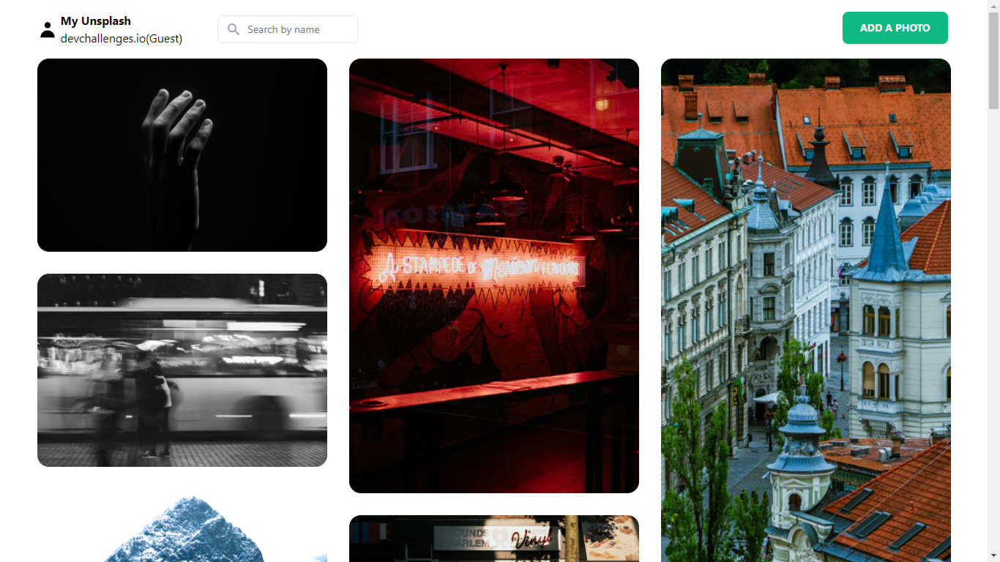
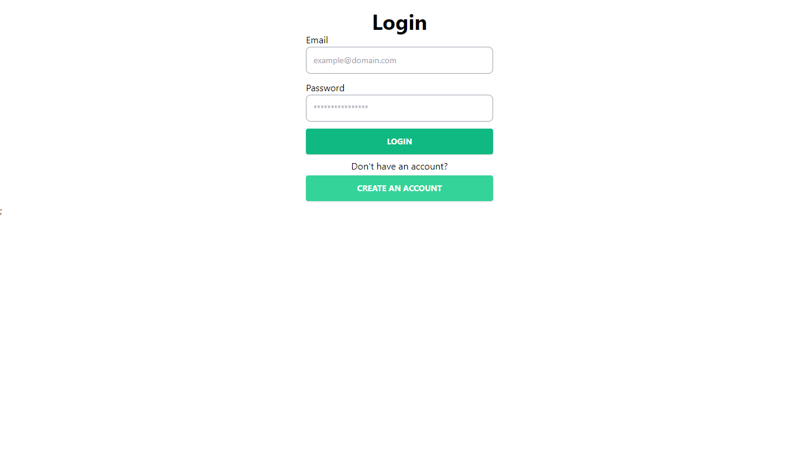
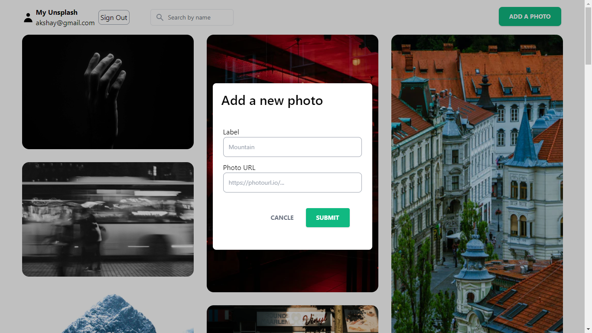
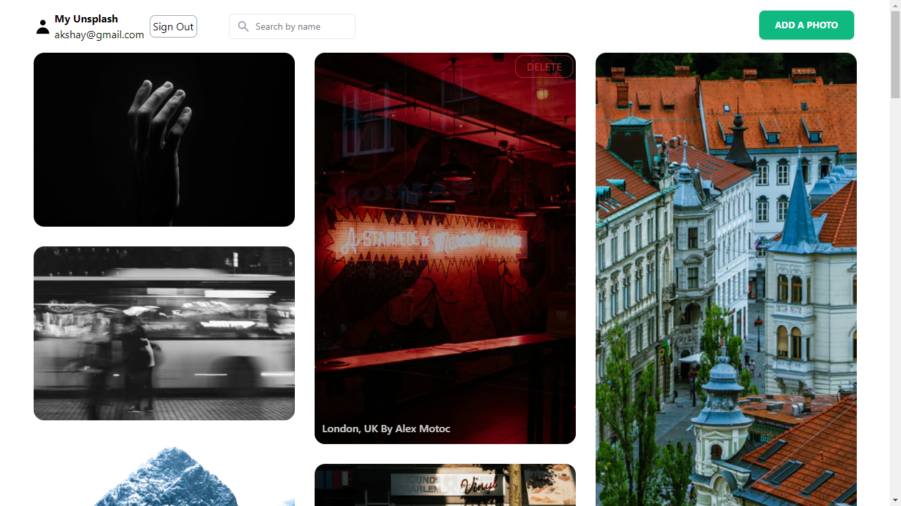
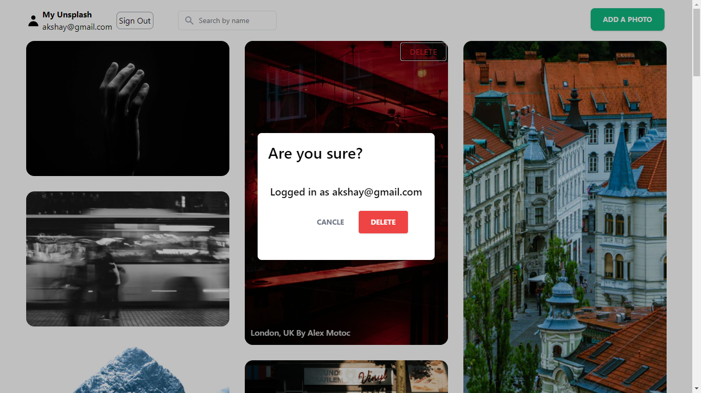

# My Unsplash

[Challenge](https://devchallenges.io/challenges/rYyhwJAxMfES5jNQ9YsP)

## Features

    1. User can see a list of photos in the masonry layout that I have added
    2. Add a new photo to the list
    3. Search for photos by label
    4. On hover a photo, User see a label and a delete button
    5. Delete images
    6. Email and Password authentication

## Tech Stack

    1. NextJS
    2. Tailwindcss
    3. Firebase (Firestore & Authentication)
    4. Deployed on vercel

## [Live DEMO](https://my-unsplash-nine.vercel.app/)

## Snapshots

**Home Page**

**Authentication Page**

**Add Photo**

**On Hover Options**

**Delete Photo**

